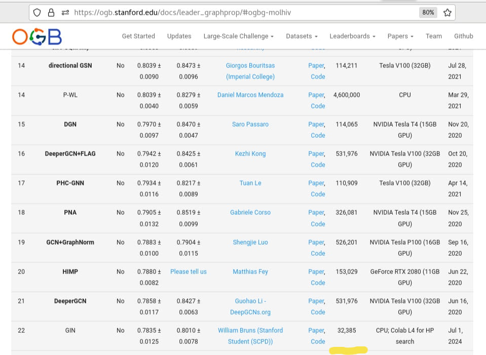
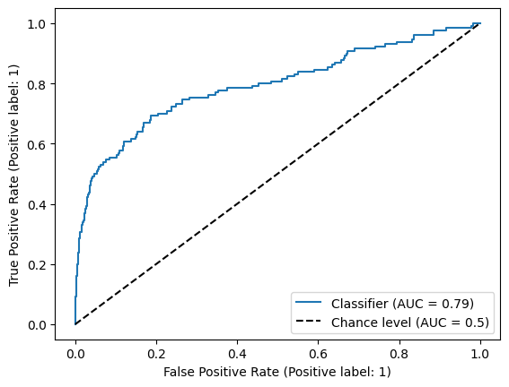

# Code for ogbg-molhiv leaderboard submission using GIN

(ogbg-molhiv is an Open Graph Benchmark Graph Property Prediction challenge to predict whether a molecule can inhibit HIV replication or not)

(see  https://web.archive.org/web/20240822032633/https://ogb.stanford.edu/docs/leader_graphprop/#ogbg-molhiv )



Results so far: rocauc 0.7835 +/- 0.0125 (mean +/- sample std, n=10) (using a small model of 32,385 total parameters trained from scratch).

These were computed from deterministic results obtained running on CPU using the random seeds 0..9 inclusive (deterministic for same software version on same setup, CPU of L4 instance in Google Colab, see notebook link below).

Nothing impressive, just to practice GNNs and participate!
Other techniques, e.g. decision tree on molecular fingerprints are more efficient for this specific task but GNNs are very generalizable and flexible for all kinds of data!

A presentation on this work and related work applying the same exact technique to the also single-task prediction of flaviviral genomic capping enzyme inhibition (slides last updated in 2025-03, link added here to README.md 2025-05-28) is available at:

https://raw.githubusercontent.com/willy-b/tiny-GIN-for-ogbg-molhiv/bf3cf14854499e271b49b3abeb87f9c45013ae0c/tiny_gin_for_ogbg-molhiv_status_update_presentation_slides.pdf (public link)

See also a very early mostly results draft writeup for applying the same tiny GIN (same architecture) to flaviviral genomic capping enzyme inhibition prediction at https://raw.githubusercontent.com/willy-b/tiny-GIN-for-WNV/initial-draft-branch/gnns-to-predict-flaviviral-genomic-capping-enzyme-inhibition.pdf  (public link, at time of writing last updated 2025-03).

(With a small change to the architecture, these tiny GINs also appear potentially competitive on multi-task prediction while remaining small (one can see in this repo that the optimal single-task architecture for the tiny GIN here is not competitive exactly as is for the separate challenge of simultaneous multi-task prediction, that is e.g. predicting 128 different molecular properties at the same time, at least on training/validation), time permitting I will make public some work on that sometime in 2025.)

## Steps to reproduce ogbg-molhiv leaderboard submission using GIN

1. Install dependencies (run `install_dependencies.sh` this comes with or commands below):

```
pip install torch-scatter -f https://pytorch-geometric.com/whl/torch-2.2.1+cu121.html
pip install torch-sparse -f https://pytorch-geometric.com/whl/torch-2.2.1+cu121.html
pip install torch-geometric # I'm using 2.5.3 right now
pip install ogb # I'm using 1.3.6 right now
```

2. Run this script `python main_gin.py` (I'm using python 3.10.12 but should be flexible)

## Leaderboard submission specifics

Hyperparameter values used:

(results in 32,385 model parameters per `sum(p.numel() for p in model.parameters())`, the advised way to count model parameters per https://web.archive.org/web/20240324175343/https://ogb.stanford.edu/docs/leader_overview/ )

- num_layers: 2

  Note: Choice of 2 layers is based on experiment and justified by e.g. GCN GNN layers/hops discussion in https://arxiv.org/pdf/1806.03536 .
  Noting that the depth of network for GNN is not the same as depth of network for non-GNN deep neural networks, as it also controls the number of hops in the graph considered for the embedding of each node; one could also make the network used to compute node embedding based on each hop deeper without changing the number of GNN layers (hops)).

- hidden_dim: 64

- dropout: 0.5

- learning_rate: 0.001

- epochs: 50

- batch_size: 32

- weight_decay: 1e-6

Trained network from scratch on CPU of Google Colab L4 instance (used L4 GPU for speed in hyperparameter search, CPU for deterministic final results),
with the following random seeds and obtained the following results:

(it will give same results if using CPU of Google Colab L4 and same version of software; see Google Colab notebook link below; randomness affects the training process when training from scratch)

```
seed 0: 0.792270 valid, 0.793741 test
seed 1: 0.808428 valid, 0.798843 test
seed 2: 0.810634 valid, 0.780251 test
seed 3: 0.790926 valid, 0.791958 test
seed 4: 0.802656 valid, 0.798700 test
seed 5: 0.805311 valid, 0.774121 test
seed 6: 0.807013 valid, 0.764565 test
seed 7: 0.804723 valid, 0.768452 test
seed 8: 0.788810 valid, 0.776000 test
seed 9: 0.798743 valid, 0.788814 test
```

Seed 0 test Receiver Operating Characteristic (ROC) curve:

(if you use the CPU of a Google Colab L4 instance per notebook linked below you should get the identical result and ROCAUC and the saved model you can use to generate a similar plot)



If you like Jupyter notebooks and/or Google Colab, you can check the results above in the following notebook, and/or copy the following notebook and run the commands to reproduce the result in their environment (please use CPU of L4 instance to reproduce randomness exactly):

https://colab.research.google.com/drive/1c3c9SO029Tv5TP_EV1Zeevof-r8CFvE4?usp=sharing

Using `torch.mean()` and `torch.std()` to report the mean and unbiased sample standard deviation, one obtains:

```
>> test_rocaucs = torch.tensor([0.793741, 0.798843, 0.780251, 0.791958, 0.798700, 0.774121, 0.764565, 0.768452, 0.776000, 0.788814])
>> print(f"test rocauc mean: {test_rocaucs.mean():.6f}, test rocauc std: {test_rocaucs.std():.6f}")
>> valid_rocaucs = torch.tensor([0.792270, 0.808428, 0.810634, 0.790926, 0.802656, 0.805311, 0.807013, 0.804723, 0.788810, 0.798743])
>> print(f"valid rocauc mean: {valid_rocaucs.mean():.6f}, valid rocauc std: {valid_rocaucs.std():.6f}")

test rocauc mean: 0.783544, test rocauc std: 0.012520
valid rocauc mean: 0.800951, valid rocauc std: 0.007822
```

Note that the **test set performance is NEVER consulted or checked by the code in selecting the model**.
For each random seed during training the held out validation set performance is checked and the epoch with best validation set performance observed so far which did not have worse training performance than the previous best is kept as the result. If one preferred not to use the validation data to select the best model checkpoint, an additional subset of training data could be held out just to determine the best checkpoint to use, and it would not be expected to affect the test performance (selection of model checkpoint just needs to be done using data not used for training/gradient descent and which is not the test data upon which score is reported).

CSVs for validation and test set predictions vs ground truth will be generated as part of the script, if however you want examples for each of the seeds, I can provide upon request. A .pkl with the model weights will be generated at the end of the script which could be reused for inference. If you would like example weights, they are available upon request (or I can add them here if multiple people ask and would not want to generate on their CPU or in Google colab).

## References

- Hu, Weihua and Fey, Matthias and Zitnik, Marinka and Dong, Yuxiao and Ren, Hongyu and Liu, Bowen and Catasta, Michele and Leskovec, Jure. Open Graph Benchmark: Datasets for Machine Learning on Graphs. arXiv preprint arXiv:2005.00687, 2020.

- Wu, Zhenqin and Ramsundar, Bharath and Feinberg, Evan N and Gomes, Joseph and Geniesse, Caleb and SPappu, Aneesh and Leswing, Karl and Pande, Vijay. Moleculenet: a benchmark for molecular machine learning. Chemical Science, 9(2):513–530, 2018.

- Fey, Matthias and Lenssen, Jan E. Fast Graph Representation Learning with PyTorch Geometric. ICLR Workshop on Representation Learning on Graphs and Manifolds, 2019. (Graph Isomorphism Network (GIN) implementation used)

- Xu, Keyulu and Hu, Weihua and Leskovec, Jure and Jegelka, Stefanie. How Powerful Are Graph Neural Networks? International Conference on Learning Representations, 2019. https://openreview.net/forum?id=ryGs6iA5Km , https://arxiv.org/pdf/1810.00826 . (Graph Isomorphism Network (GIN) original paper)

## Acknowledgements

Credit to Stanford XCS224W (certificate of completion with link to course and program info can be found at https://digitalcredential.stanford.edu/check/27C7D07B3EF8511E8B9BBA720E9A7C51BE3CBC49F80B7F32D1839B5D24442250U3BuVnNsVW9ldVdCQURiRXFZSXo2d3ZlOW5BSDJWVzUrVit1VGFQRHN2UVhVYjQ3 ),
they had a homework assignment using the ogbg-molhiv dataset which inspired this (the OGB leaderboard was not mentioned in and is not part of the course and this is NOT a copy paste of the homework - which used GCNConv instead of GIN for example and had many other differences in design).

Credit to "Massively Multitask Networks for Drug Discovery" (Ramsundar et al 2015, https://arxiv.org/abs/1502.02072 ) and "Discovery of a structural class of antibiotics with explainable deep learning" (Wong et al 2023, https://www.nature.com/articles/s41586-023-06887-8 ) for inspiring me to pursue this challenge and to the authors of Wong et al 2023 in particular for making the world a better place by discovering new antibiotics for MRSA using deep learning.

Credit to "Keeping Neural Networks Simple by Minimizing the Description Length of the Weights" ( Hinton et al 1993, https://www.cs.toronto.edu/~fritz/absps/colt93.pdf ), and "Representation Learning on Graphs with Jumping Knowledge Networks" ( Xu et al 2018, https://arxiv.org/abs/1806.03536 ) for giving me ideas that helped me reduce the parameter count while improving generalization (the test data is chosen to be out of distribution; different molecular structure).

Note, this uses the atom and not the edge features of the dataset. I will be continuing to work on models to improve upon the score here and at time of writing I was working on this for ~1 week, but do not expect anything to replace this submission from me for some time (due to time required to run experiments and no reason to believe small changes will beat current performance in a statistically significant way) so submitted this as is. This same code will work if the dataset id is changed for ogbg-molpcba -- I am adding that next and attempting to pretrain on that to improve performance on this right now.
